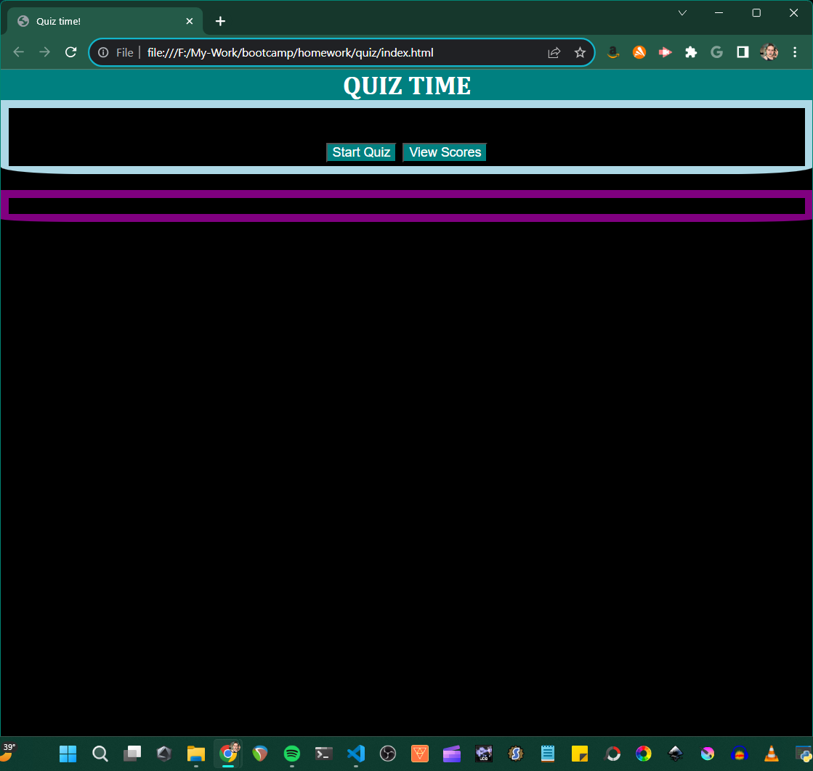
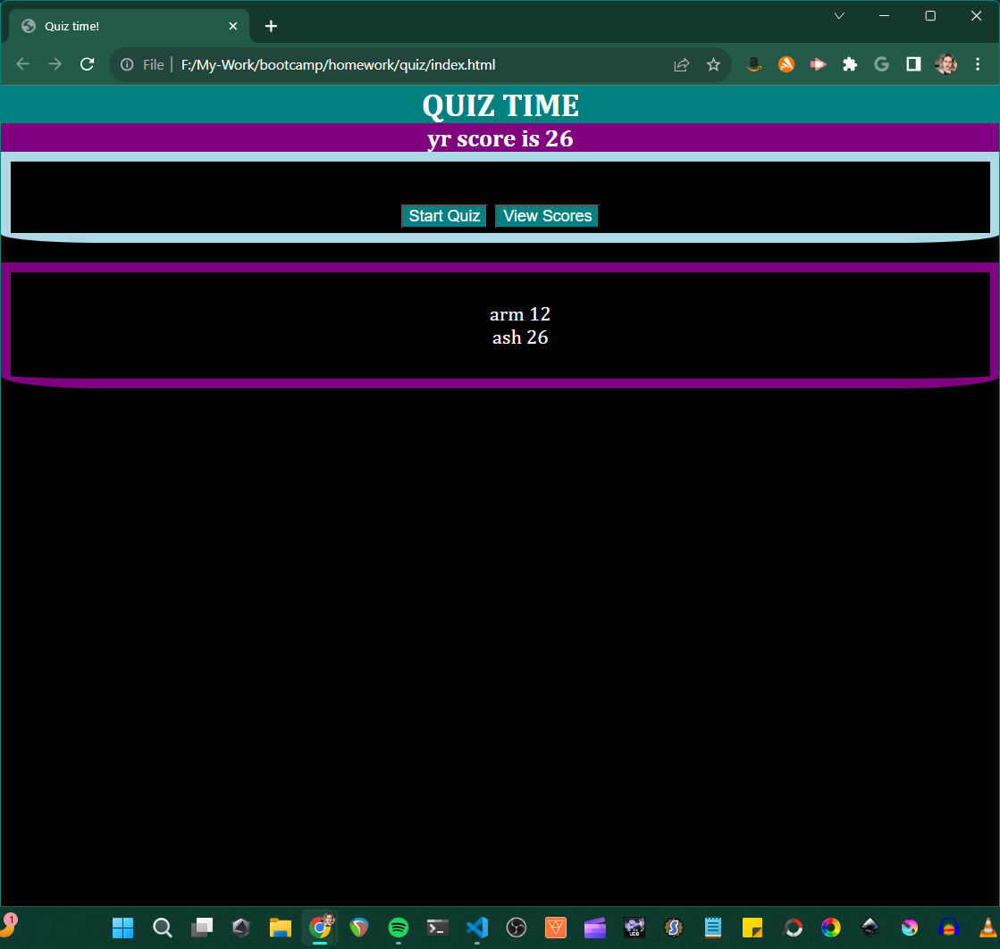

# quiz

# Description

An interactive timed quiz which saves user initials and score for later view.

# Usage

To learn something while taking a fun little quiz.

[link-to-site](https://e6m9.github.io/quiz)